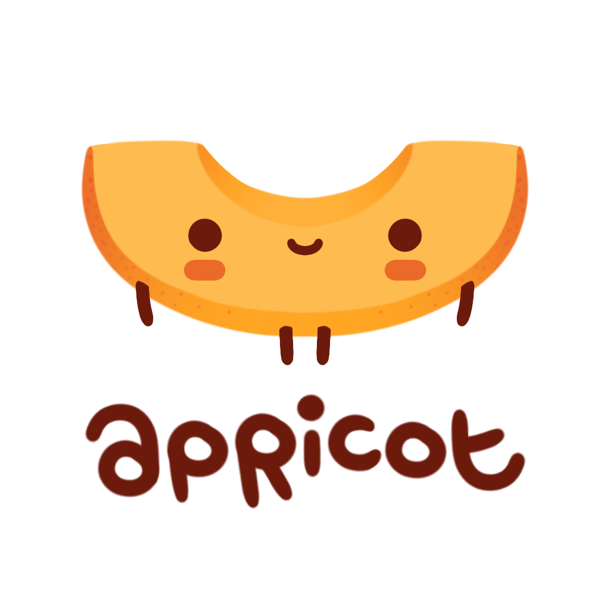

# Apricot
<p align="center">
  
</p>

Apricot is my game engine I decided to make in free time out of boredom. If I succeed it should be usable for creation
of simple 2d games for game jams. Core concepts I want to follow during development:
- Engine should support extreme fast iteration speed, meaning support of .NET hot reload and general flexibility
- Support both desktop and web builds
- "Good enough" principle without too much of overengineering - I am mostly jamming, not creating 3D high-fidelity apps
- Test coverage and proper CI 

As of writing this nothing of this is supported as I am getting started, but let's see where it would take me

# Etymology
Apricot is a good fruit to make jam and put it into jar

# Dependencies
Project is developed with .NET 9 and C# 13

Engine itself is planned to be Graphical API\Backend\OS-agnostic, yet main implementation as for now is working with use
of SDL3 which was pre-compiled. All external dependencies (including precompiled SDL stuff) is stored in External folder

# Building
Clone repository with 

```bash
git clone --recursive git@github.com:ApricotPress/apricot.git
```

If new assets added to essentials you may want to tun Apricot.Build project from repository root to bake new assets. As
otherwise you will need to ensure you have all importers shipped with game (HLSL compiler is over 75 megabytes, so I 
would not recommend  it :D)

# Some other notes 
- I mainly work with Unity yet have experience of various game engines for inspiration. Although, I don't hesitate to 
see what's going on inside [Foster](https://github.com/FosterFramework/Foster), [libGDX](https://libgdx.com), and some
others
- Atm engine looks pretty close to Foster, FNA but later on I have plans to extend with proper object and scene systems
